# Udacity Robotics Software Engineering ND

# Follow Me Project

The final project of the first term of Robotics Sofware Engineering Nanodegree - Udacity 

## Table of Contents

[TOC]

## Setting Up The Environment

In this project, you will train a deep neural network to identify and track a target in simulation. So-called Table of Contents about this “follow me” applications like this are key to many fields of robotics and the very same techniques you apply here could be extended to scenarios like advanced cruise control in autonomous vehicles or human-robot collaboration in industry.

To set up local environment or use given options of web servers, please see the document below: 

https://github.com/udacity/RoboND-DeepLearning-Project

## Scope

The scope of this project is to train a fully convolutional neural network so that a drone can recognize a
specific person and follow them in simulation. 

The rubric for this project can be found here: https://review.udacity.com/#!/rubrics/1155/view

## Introduction 

In previous lectures, neural networks were trained to recognize images of letters. In these lectures we're tried to define a picture like is it A? or B? etc.

To overcome the problem convolutional neural network was introduced. Convolutional Neural Network (CNN) applies the model to small window instead of the full image. Then slides it across the entire image. The advantage of a CNN over a regular deep neural network is that a CNN can be trained to recognize ‘Is this a picture of an A’ with the A appearing anywhere in the picture. To train a deep neural network to do the same would require a much larger data set.

Fully Convolutional Networks (FCN) are an improvement over CNNs. In a FCN the fully connected layer is
replaced with a 1x1 convolutional layer, allowing spatial information to be retained. The benefit of a FCN
is that it will say not just ‘Is this a picture of an A? but where in this picture is the A?

## Brief Information

In this section the course lectures will be introduced, but won't be dived into much detail since details and other informations can be found in lectures. 

### Neural Networks

We started the course from Introduction to Neural Networks, in these lectures we learned how to create a neural network with perceptron algorithm. We can call the perceptron as a smallest deciding unit in the network. Perceptrons do their deciding or classification algorithm by using input and output elements. 

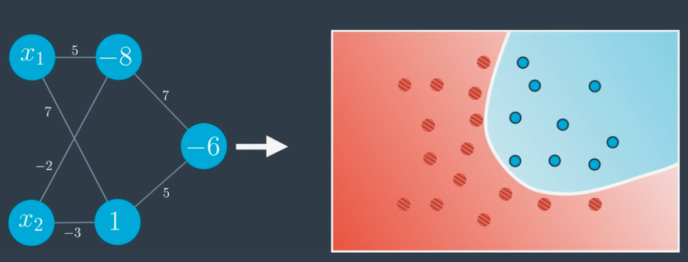

An example of neural network separates and classifies the given input data

### Deep Neural Network

In this lectures, we learned the non-linearities. The simplest non-linear function Rectified Linear Units (RELU) was learned. After that, we created our neural network with RELUs. We insert a RELU right in the middle of neural network instead of having single matrix multiplier, please see the image below: 

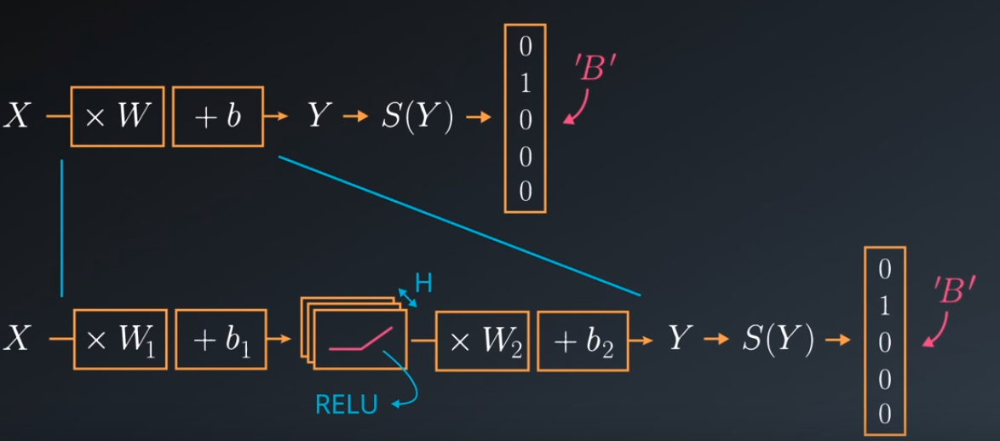

After that, we created our deep neural nets, simply contains multilayer in the networks. Adding a hidden layer to a network allow it to model more complex functions. Also, using a non-linear activation function (like RELU) on the hidden layer lets it model non-linear functions. 

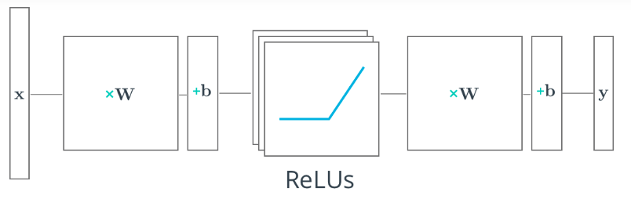

A 2 layer neural network can be seen the image above.

1. The first layer effectively consists of the set of weights and biases applied to X and passed through ReLUs. The output of this layer is fed to the next one, but is not observable outside the network, hence it is known as a *hidden layer*.
2. The second layer consists of the weights and biases applied to these intermediate outputs, followed by the softmax function to generate probabilities.

### Convolutional Neural Network (ConvNets)

A Convolutional Neural Network (ConvNet/CNN) is a Deep Learning algorithm which can take in an input image, assign importance (learnable weights and biases) to various aspects/objects in the image and be able to differentiate one from the other.

A normal convolutional neural network layer with 2D kernel size of 5x5 looks like following: 

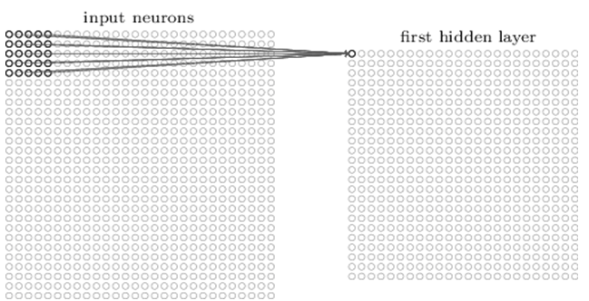


In each layer, the kernel will be moving across inputs predefined stride and record an context (as output) in each move. The image can be seen below: 

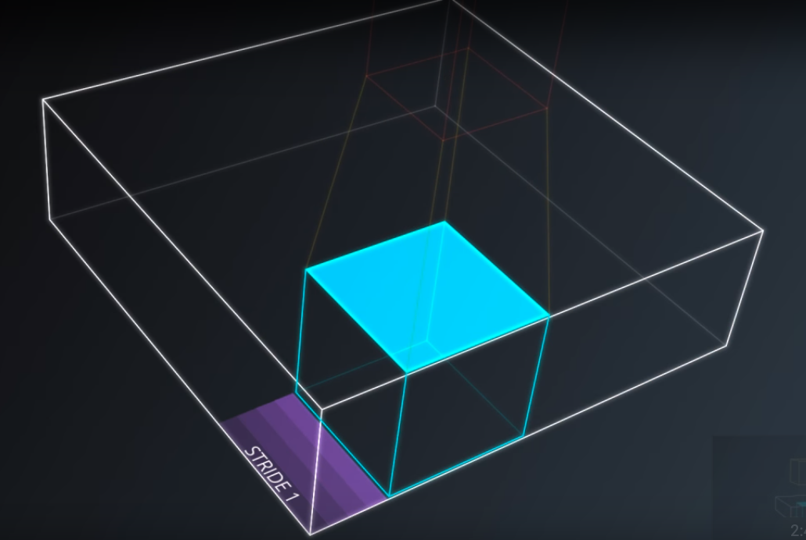

As mentioned above, we thought the images as three dimensional with height, width and depth. In images our depth variable is three because they consist of R,G,B channels. These were our inputs.

Now we take the small patch of the every image, and run a tiny neural network on them with say, K outputs. We represented the outputs like a tiny column can be seen the image below. We translated our neural networks across the image without changing the weights. 

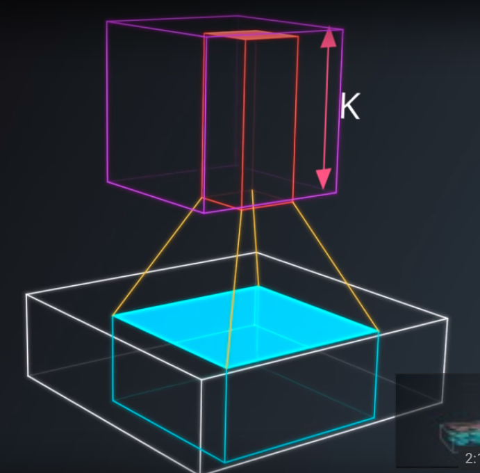

A CNN might have several layers, each layer might capture a different level in the hierarchy of objects. The first layer is the lowest level in the hierarchy, where the CNN generally classifies small parts of the image into simple shapes like horizontal and vertical lines and simple blobs of colors. The subsequent layers tend to be higher levels in the hierarchy and generally classify more complex ideas like shapes (combinations of lines), and eventually full objects like cars.

A CNN with multiple CNN layers will look as following:

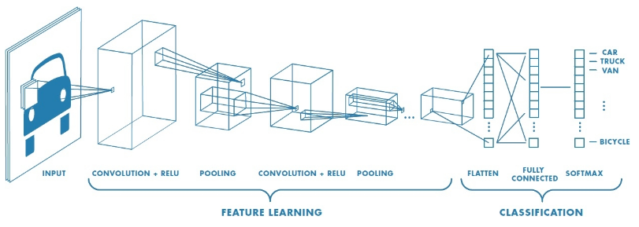

CNNs are usually used to classify objects inside an image as shown above, the output is a class of car, truck, van, etc.

### Fully Convolutional Networks

Unlike the convolutional neural networks previously introduced, an FCN transforms the height and width of the intermediate layer feature map back to the size of input image through the transposed convolution layer, so that the predictions have a one-to-one correspondence with input image in spatial dimension (height and width). Given a position on the spatial dimension, the output of the channel dimension will be a category prediction of the pixel corresponding to the location.

Fully Convolutional Networks (FCN) take the advantage of three special techniques: 

- Replace fully connected layers with one by one convolutional layers

  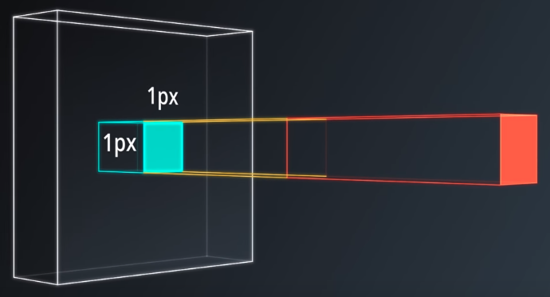

  

- Up sampling through the use of transposed convolutional layers

  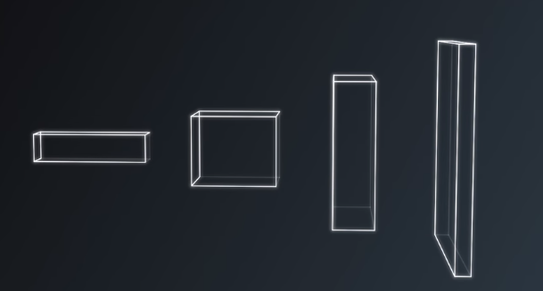

- Skip connections: Skip connections allow the network, to use information from multiple resolution cases.

  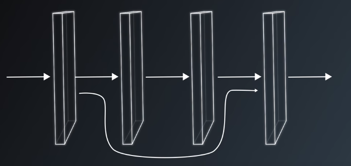

  Structurally, FCNs are constructed with two parts: Encoder, Decoder.

  Encoders are series of covnets like VGG and ResNet. The goal of the encoder is to extract features from the given input, in here image. 

  The decoder scales the output of the encoder such that it's the same size as the original input. 

  Totally, it's the result of each individual pixel in the original input (image)

## Network Structure

All the network structure figure will be given below, these topics are for knowledge. 

### Encoder

The encoder portion of the network is a series of convolution steps. The encoder gradually squeezes
spatial dimensions while increasing the depth. More depth provides more feature maps for semantic
segmentation.

### 1x1 Convolution

The use of a fully connected layer would change the output dimensions of the convolution tensors from 4D to 2D, causing spatial information to be lost. Replacing the fully connected layer with a 1x1
convolution maintains the spatial information.

### Decoder

The decoder upscales the output of the encoder such that it is the same size as the original image. This
allows the FCN to be applied to images of any size.

### Skip Connections

Skip connections are connections of one layer’s output to a non-adjacent layer’s input. As convolutions
are applied to an image the network is effectively looking closer and closer at the image. By including
information from a different level of “zoom,” bigger picture information is retained.

### Seperable Convolutions 

The encoder and decoder blocks of the FCN were constructed using separable convolutions. In a separable convolution a convolution is performed on each channel of the input layer individually, and
then a 1x1 convolution is performed on the output. Using separable convolutions reduces the number of parameters that are needed in the convolution step, decreasing the computational burden.

### Bilinear Upsampling

The decoder must create a layer with more spatial information than the previous layer. In order to do
this the decoder must use a technique to interpolate between points in the input layer. The method
used for this project is called bilinear upsampling. For this process the weighted average value of the
four nearest known pixels are used to estimate the value for the new pixel.

## Model Definitions

The model for this project was built by using Keras, which is an open source library, containing abstractions for the constituent pieces of neural networks. 


For more information about Keras please click the link:  https://keras.io/

### Complete Model

The network diagram of my model can be seen below: 

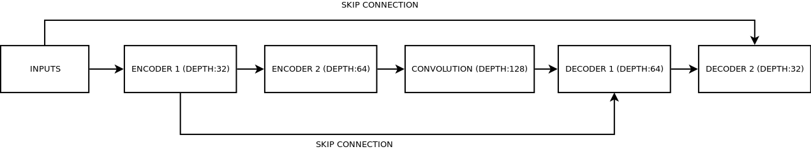

### Encoder Block 

The encoder block accepts three arguments: the input layer, the number of feature maps, and the stride
length of the convolution. A batch-normalized separable convolution is applied to the input layer to create the output layer.

### 1x1 Convolution 

The 1x1 convolution accepts two arguments: the input layer and the number of feature maps. A batch-
normalized 1x1 convolution is applied to the input layer to create the output layer. A separable convolution is not used because it would not reduce the number of parameters for a 1x1 convolution.

### Decoder Block

The decoder block accepts three arguments: the input layer, the skip connection layer, and the number
of feature maps. The input layer is first upsampled using bilinear upsampling. Next the upsampled input
layer is concatenated with the skip connection layer. A batch-normalized separable convolution is applied to the concatenated input layers to create the output layer.

## Training 

All the training was done by using Udacity Workspace. 

### Hyper Parameter Definitions

***Batch Size:*** Number of training samples/images that get propagated through the network in a single pass.

***Number of Epochs:*** Number of times the entire training dataset gets propagated through the network.

***Steps per Epoch:*** Number of batches of training images that go through the network in one epoch. 

***Validation Steps:*** Number of batches of validation images that go through the network in one epoch. This is similar to steps per eopch, except validation steps is for the validation dataset. 

***Workers:*** Maximum number of processes to spin up. This can affect your training speed and is dependent on your hardware. 

### Run 1

For the first I started with a simple model to get the baseline IOU score. I used a two encoder blocks, 1x1 convolution and a two decoder blocks. 

There were two principles I used from the lessons in order to choose the depth. The first principle is that depth corresponds roughly with semantic complexity. The more feature maps in a layer, the more features the model can recognize. 

The second principle is that in each encoder layer the spatial information should be gradually squeezed while increasing the depth. 

Using these principles, I decided to start with a depth of 32 & 64 for the encoder blocks respectively and   depth with 128 for the 1x1 convolution. The depth of the decoder blocks correspond to the encoder blocks.

This model saved with the name: *model_weights*

**Hyper parameter selection**

* Learning rate is **0.01** selected, as small as possible initially. Actually, I selected the learning rate which I used in Lab: Semantic Segmentation. 
* Batch Size: **128** is selected to prevent GPU overload in given Udacity's Workspace.
* Number of Epoch: **20** is selected, since Lab:Semantic Segmantation's number of epoch was 10 & worked with no problem. I decided to increase number of epoch loops.
*   Steps per Epoch: For the first run, I took the default value which is given.
* Validation Steps: I took the default value which is given.
* Workers: Increased to **4** to speed up the simulation process. 

Used hyper parameters for my first run was: 

```python
#changing hyperparameters
learning_rate = 0.01
batch_size = 128
num_epochs = 20
steps_per_epoch = 200
validation_steps = 50
workers = 4
```

With the parameters given above I get the below results: 

*Last epoch result:*

```python
loss: 0.0167 - val_loss: 0.0308
```

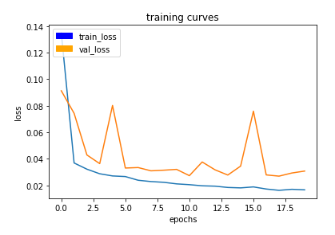

*The final IOU score for this model was **0.38**, sadly having the score below of the project :(* 

```python
# And the final grade score is 
final_score = final_IoU * weight
print(final_score)

>> 0.389996681054
```

To achieve the goal of **0.40** IoU score, I changed the hyper parameters (will be discussed in the Discussions section).

### Run 2

Since I'd not be able to achieve the goal, I changed the hyper parameters. And run the simulation with higher steps per epoch & lower learning rate. 

This model saved with the name: *model_weights_run_2*

**Hyper parameter selection**

- Learning rate is **0.008** selected for the second run. To overcome the goal. 
- Batch Size: **128** is selected to prevent GPU overload in given Udacity's Workspace.
- Number of Epoch: **20** is selected, since Lab:Semantic Segmantation's number of epoch was 10 & worked with no problem. I decided to increase number of epoch loops.
- Steps per Epoch: For the second run, I increased this value to **500**. 
- Validation Steps: I took the default value which is given.
- Workers: Increased to **4** to speed up the simulation process. 

With the hyper parameters below: 

```python
#changing hyperparameters
learning_rate = 0.008
batch_size = 128
num_epochs = 20
steps_per_epoch = 500
validation_steps = 50
workers = 4
```

With the parameters given above I get the below results: 

*loss: 0.0110 - val_loss: 0.0316Last epoch result:*

```python
loss: 0.0110 - val_loss: 0.0316
```

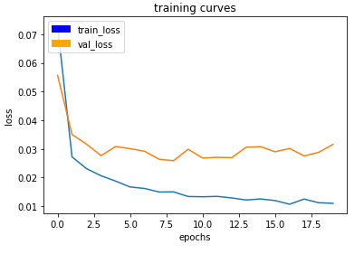

```python
# And the final grade score is 
final_score = final_IoU * weight
print(final_score)

>> 0.417994365455
```

## Discussions

The final IoU score for this model was **0.41799**. Improving on the previous model and exceeding the goal benchmark. Interestingly, the validation loss for this run was higher than previous model, but the IOU
score was still significantly better.

* Increasing the steps per epoch parameter, took very long time to complete the simulation but; it increased the number of batches in each epoch. So it effected my simulation result in positive direction. 
* Also decreasing the learning rate of the simulation from 0.01 to 0.008 increased the success rate of IoU score. By decreasing the learning the neural net learned slowly but they learned well comparing to previous run. 

### Further Improvements

The quickest way to improve the model would be to collect more data. Collecting more images with the target in the distance would improve the IoU score. 

If this model was to be adapted for following another object, such as an animal or a car, new training images would have to be collected. Whether or not the model would work well for the new application
depends on the semantic complexity of the new object and how much it differs from the non-target
objects in its environment. At the very least, all new training data would be required.

## Notes for Reviewer

For **run_1** the submission files can be found in: 

HTML Format:[model_training.html](./run_1/model_training.html) 

ipynb Format:[model_training.html](./run_1/model_training.ipynb) 

Model Weights: [model_weights](./run_1/model_weights)

For **run_2** the submission files can be found in: 

HTML Format:[model_training.html](./run_2/model_training.html) 

ipynb Format:[model_training.ipynb](./run_2/model_training.ipynb) 

Model Weights: [model_weights](./run_2/model_weights)

